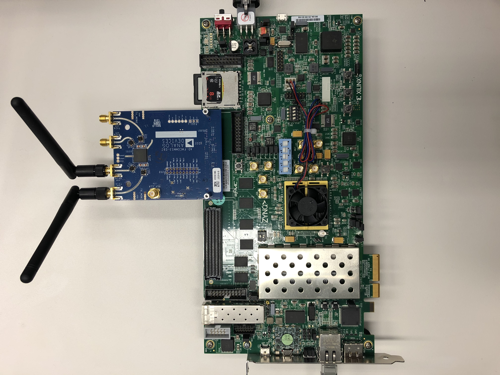
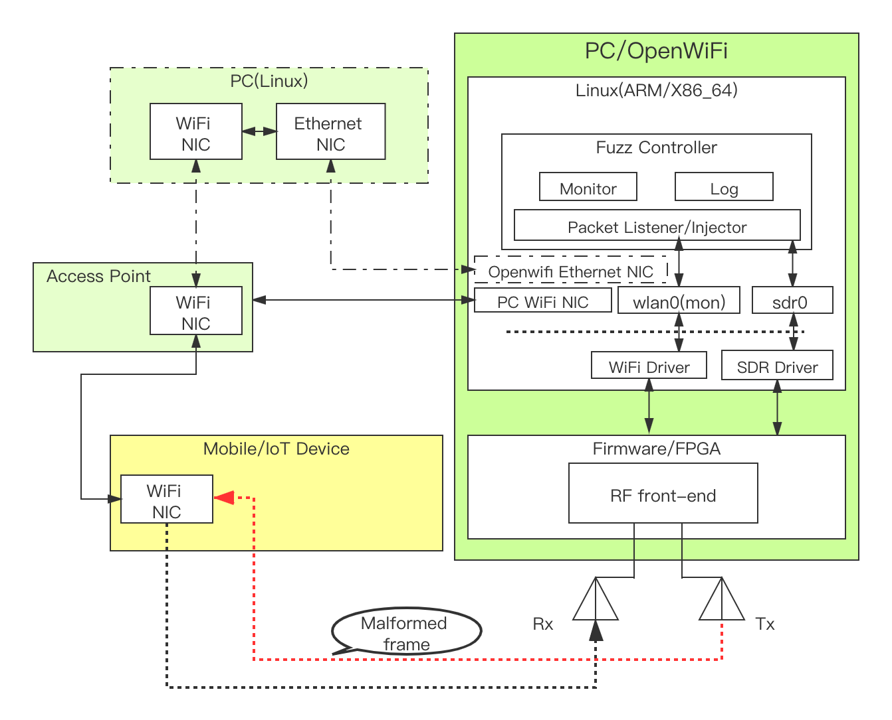

<!--
Author: Hongjian cao(E7mer)
-->

# owfuzz


**owfuzz:** a WiFi protocol fuzzing tool using [openwifi](https://github.com/open-sdr/openwifi). 

Openwifi is an open-source WiFi protocol stack based on SDR that is fully compatible with Linux mac80211. It's driver takes advantage of the Linux kernel's supports (mac80211, cfg80211) for WiFi high MAC, so it can provide an interface to the application layer like a common WiFi USB dongle. In The hardware part, CSMA/CA protocol and other functions of WiFi low MAC layer are implemented on FPGA. It supports monitoring and injection of arbitrary WiFi frames，The application layer software can also directly communicate with the openwifi driver/FPGA/RF underlying functions through nl80211, which provides users with great autonomous and controllable ability. Owfuzz is the first to use openwifi platform to implements a WiFi protocol fuzzing test framework, which supports the fuzzing test of all WiFi frames and the interactivity testing of WiFi protocols. 

Owfuzz can also use a wireless network card that supports monitor mode and frame injection.


**Architecture**



**Features:**

- IEEE Std 802.11 1999/2007/2012/2016/2020
- 2.4Ghz and 5Ghz
- Supports all WiFi devices: APs and Clients
- Fuzzing all frames: management/control/data
- Any state of WiFi
- Interactivity testing
- OPEN/WEP/WPA/WPA2/WPA3
- Automatically generates poc log and locates the vulnerability.
- Multichannel monitor and transmission


## Usage
- owfuzz usage:
	- example: sudo ./owfuzz -i wlan0 -m ap -c [channel] -t [target-mac] -b [ap-mac] -s [ap-mac] -T 2 -A WPA2_PSK_TKIP_AES -I [targe-ip]
	- -i [interface], Interface to use.
	- -m [ap/sta/mitm], Set the mode of fuzzer, default is ap.
	- -c [channel], Set the working channel of fuzzer, default is 1.
	- -t [mac], Target's MAC address.
	- -S [SSID], AP's SSID.
	- -A [auth type], Target's auth type: OPEN_NONE, OPEN_WEP, SHARE_WEP, WPA_PSK_TKIP, WPA_PSK_AES, WPA_PSK_TKIP_AES, WPA2_PSK_TKIP, WPA2_PSK_AES, WPA2_PSK_TKIP_AES, EAP_8021X, WPA3
	- -I [IP address], Target's IP address
	- -b [BSSID], AP's Mac address
	- -s [mac], Fuzzer's (source) Mac address.
	- -T [test type], Test type, default 1, 0: Poc test, 1: interactive test, 2: frames test, 3: interactive & frames test
	- -f [log file], Log file path
	- -h Help.

## Building

- Install dependencies (Kali/Ubuntu)
```
sudo apt-get install pkg-config libnl-3-dev libnl-genl-3-dev libpcap-dev
```

- Compiling
```
make
```

## Start in [openwifi](https://github.com/open-sdr/openwifi#quick-start)
- Copy owfuzz and openwifi_owfuzz.sh to openwifi with password **openwifi**.
  ```
  scp -r owfuzz openwifi_env.sh root@192.168.10.122:~/
  ```

- Login to the board from your PC (PC Ethernet should have IP 192.168.10.1) with password **openwifi**.
  ```
  ssh root@192.168.10.122
  ```

- Install dependencies
```
sudo apt-get install pkg-config libnl-3-dev libnl-genl-3-dev libpcap-dev
```

- Compiling
```
make
```

- Init openwifi env
  ```
  ./openwifi_owfuzz.sh
  ```

## Example

- Fuzzing Client
```
sudo ./owfuzz -i wlan0 -m ap -c [channel] -t [sta-mac] -b [ap-mac] -s [ap-mac] -T 2 -A WPA2_PSK_TKIP_AES -I [sta-ip]
```

- Fuzzing AP
```
sudo ./owfuzz -i wlan0 -m sta -c [channel] -t [ap-mac] -b [ap-mac] -s [sta-mac] -T 2 -A WPA3 -S [ssid-name] -I [ap-ip]
```

- Interactivity fuzzing
```
sudo ./owfuzz -i wlan0 -m ap -c [channel] -t [sta-mac] -b [ap-mac] -s [ap-mac] -T 1 -A WPA2_PSK_AES
```

## Discovered vulnerabilities

Please see [here](https://github.com/E7mer/Owfuzz).


## License

This project is available as open source under the terms of the GPL 3.0 Or later. However, some elements are being licensed under GPL 2-0 or later and BSD 3 license . For accurate information, please check individual files.
